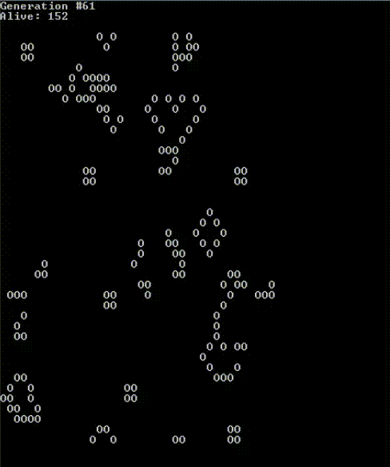

# Description

The progress of the game is evolution: one generation changes another.
Each generation is fully determined by the previous generation. The future of
each cell depends on its neighbours (adjacent cells).

As you can notice, each cell has eight neighbors. We consider the universe to
be periodic: border cells also have eight neighbors. For example:

If cell is right-border, its right (east) neighbor is leftmost cell in the same row.
If cell is bottom-border, its bottom (south) neighbor is topmost cell in the same column.

Corner cells use both solutions.

Evolution is controlled by two rules:

  - *A live cell survives if it has two or three live neighbors; otherwise,
    it dies of boredom (<2) or overpopulation (>3).*
  - *A dead cell is reborn if it has exactly three live neighbors.*

The program should apply these rules to each cell in order to compute the next
generation.

At this stage, you should make several consecutive generations.
For this, you have to store the state of the universe in memory.

Use 2-dimensional arrays for this task. You need two arrays: one for the current
generation and one for the next. 
Add these arrays to the program and implement the algorithm of getting the next
generation.

The input data is three numbers in one line. The first is N (N>0), the size of
the universe; the second is S, that you should use as seed for "math/rand"; the
third is M (M≥0), the number of generations your program should create.

Output data: a square matrix NxN: there must be N lines with N characters in each
line. If there is a live cell, place the letter ‘O’, otherwise, whitespace. The 
matrix should describe the generation after M steps from the beginning. 
So if M==8, you should find generation #9 (first is #1).
Examples

The lines that start with > represent user input.

### Example 1:
```
> 4 4 0
O OO
OO O
O O
OO  
```
### Example 2:
```
> 8 1 10
O    O
O   OO O
      O


      OO
```
### Example 3:
```
> 10 10 100


   O
  O
         O

   O  OO
O O   O  O
       OO
```
# Description Part 2

Well, now the universe is created, and its laws work properly.

Let’s visualize evolution. In the previous stage, we could see only one generation. 
It would be better if the program displayed each generation sequentially, one after one.

For this stage, the only input is an int number for the size of the universe. 
The universe for this stage is a square. Also, in this stage, you shouldn't set the seed 
to generate an initial position; it should be random.

The launched application must show evolution in progress. Output every generation to the console,
one after one; you should output at least 10 generations before stopping the application.

Below you can see an animated GIF with an example of the output of each generation one after one.
Even though the previous generation output gets cleared before printing a new generation to the:

